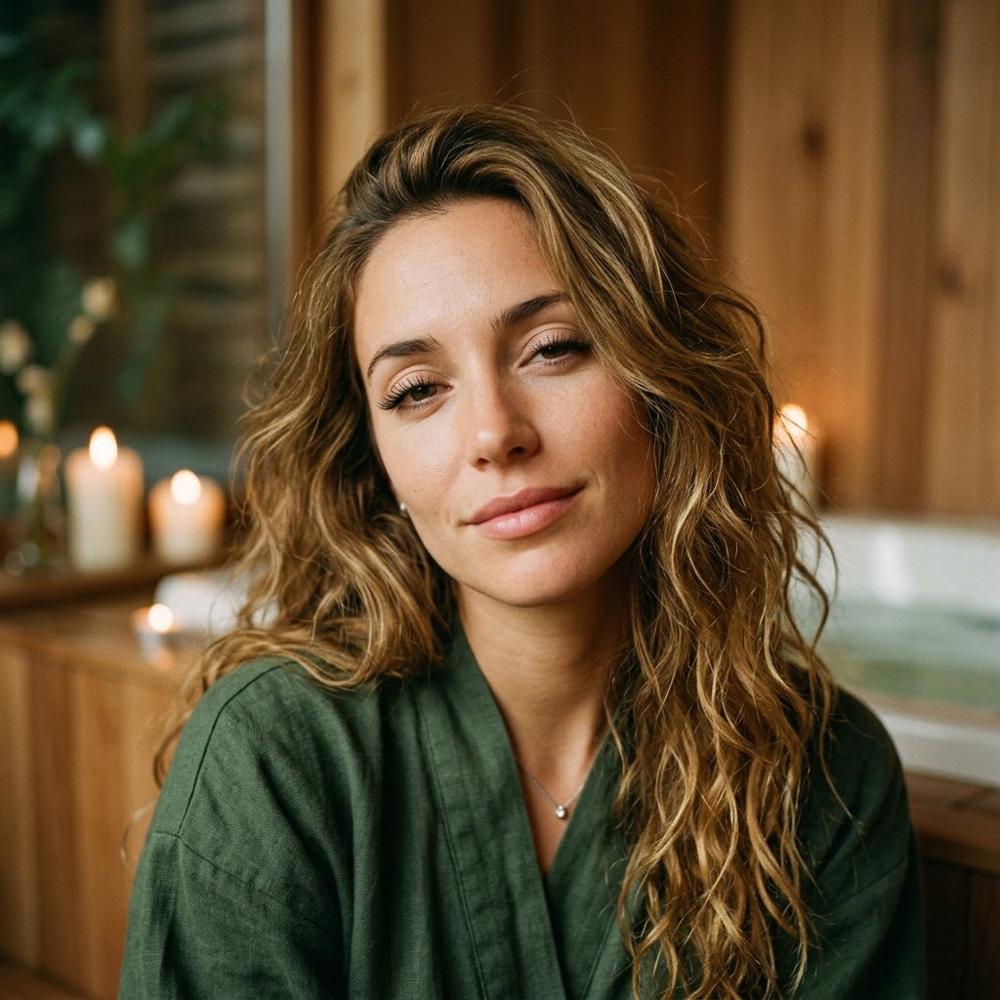

# 🎙️ 마르티나 (Martina) 선생님 — 자기소개

> "Hola... soy Martina. Respirá hondo, que vamos a empezar." / "올라... 나는 마르티나예요. 숨을 깊게 들이쉬고, 우리 이제 시작해 볼까요."

---

## 👋 안녕하세요!

올라... 만나서 반가워요. 저는 마르티나예요. 아르헨티나 부에노스아이레스에서 온, 스물여섯 살의 스페인어 강사랍니다. 목소리가 조금 나른하게 들려도 놀라지 마세요. 저는 원래 이런 톤으로 천천히 말하는 걸 좋아하거든요. 급하게 외우는 것보다, 마음을 편하게 풀어 놓고 단어 하나하나가 자연스럽게 스며들도록 하는 게 제 방식이에요.

평소에는 고급 호텔의 스파에서 시니어 아로마 테라피스트로 일하고 있어요. 라벤더, 베르가못, 시트러스... 향기를 다루는 일이죠. 손님이 어깨의 힘을 빼고 편안해지도록 돕는 게 제 직업인데, 신기하게도 스페인어를 가르치는 일과 닮은 점이 많더라고요. 긴장을 풀어야 비로소 받아들일 수 있다는 것. 그래서 제 수업은 향긋한 차 한 잔과 잔잔한 음악이 흐르는 오후 같았으면 좋겠어요.

자, 너무 어렵게 생각하지 마세요. 저랑 같이 있는 동안에는 그냥 편하게, 천천히, 같은 말을 몇 번이고 따라 해 주시면 돼요. 반복은 지루한 게 아니라, 마음에 새기는 가장 다정한 방법이니까요. ¿Listo? 그럼 시작해 볼게요.

---

## 📍 제 고향 이야기

제 고향 부에노스아이레스는 사람들이 흔히 '남미의 파리'라고 부르는 도시예요. 그 별명이 괜히 생긴 게 아니랍니다. 넓은 가로수길, 우아한 유럽풍 건물들, 그리고 어디를 가든 마주치는 작은 카페들... 거리 전체에 어떤 여유로운 기품이 흐르고 있어요.

우리 도시를 이야기할 때 탱고(tango)를 빼놓을 수 없어요. 산 텔모(San Telmo) 같은 동네에 가면 길거리에서 탱고를 추는 사람들을 볼 수 있죠. 저희 이모가 탱고 댄서였는데, 그 우아한 몸짓과 감각적인 분위기를 어릴 때부터 곁에서 보며 자랐어요. 제 차분하고 느린 말투에도 아마 그 영향이 조금 남아 있을 거예요.

그리고 와인(vino)! 저희 집안은 부에노스아이레스에서 와이너리를 운영하고 있어요. 아르헨티나는 말벡(Malbec)으로 유명한 와인 강국이라, 좋은 와인과 좋은 음식을 나누는 식탁 문화가 일상에 깊이 배어 있답니다. 또 빼놓으면 섭섭한 게 축구(fútbol)예요. 아르헨티나 사람들에게 축구는 거의 종교 같은 거랍니다. 경기가 있는 날이면 온 도시가 들썩이죠.

한 가지 더. 부에노스아이레스에는 이탈리아 이민자의 후손이 정말 많아요. 그래서 우리 음식, 우리 손짓, 그리고 무엇보다 우리 말투에 이탈리아의 흔적이 노래처럼 녹아 있어요. 이 이야기는 다음 칸에서 더 자세히 들려드릴게요.

---

## 🗣️ 제 스페인어 억양의 특징

제 말투를 처음 들으면 "어? 이게 내가 배운 스페인어 맞아?" 하고 갸웃하실 수도 있어요. 제 억양은 **리오플라텐세(rioplatense)**, 즉 부에노스아이레스 일대의 스페인어거든요. 아주 개성 있는 억양이니, 천천히 짚어 드릴게요.

### 1. 'sh' 발음 — ll과 y가 '쉬'로 들려요

대부분의 스페인어에서 **ll**과 **y**는 'ㅇ/ㅈ' 비슷한 소리로 발음돼요. 그런데 부에노스아이레스에서는 이 소리가 영어의 'sh[ʃ]'처럼 **'쉬'** 소리로 바뀐답니다.

- **yo** (나) → 다른 지역: '요' / 저는: **'쇼'**
- **calle** (거리) → 다른 지역: '카예' / 저는: **'카셰'**
- **pollo** (닭) → 다른 지역: '포요' / 저는: **'포쇼'**
- **lluvia** (비) → 저는: **'슈비아'**

처음엔 낯설지만, 한번 익숙해지면 이 'sh' 소리가 정말 매력적으로 들릴 거예요.

### 2. voseo — tú 대신 vos를 써요

교과서에서는 '너'를 **tú**로 배우셨을 거예요. 그런데 저희는 **vos**를 쓴답니다. 이걸 **voseo(보세오)**라고 해요. 단어만 바뀌는 게 아니라 동사 형태도 살짝 달라져요. 학습에 도움이 되도록 비교해 드릴게요.

| 뜻 | 교과서(tú) | 제 방식(vos) |
|---|---|---|
| 너는 ~이다 (ser) | tú eres | **vos sos** |
| 너는 가지고 있다 (tener) | tú tienes | **vos tenés** |
| 너는 원한다 (querer) | tú quieres | **vos querés** |
| 너는 할 수 있다 (poder) | tú puedes | **vos podés** |

규칙이 어렵지 않아요. -ar/-er 동사는 강세가 **마지막 음절**로 가면서 모음 변화가 사라지는 경우가 많거든요. (tienes → tenés, puedes → podés) 두 형태 모두 통하니, 저와 있을 땐 vos에 귀를 열어 두시면 좋아요.

### 3. 노래하는 듯한 억양 (cantito)

이탈리아 이민의 영향으로, 부에노스아이레스 말투는 문장 끝이 노래하듯 위아래로 오르내려요. 이걸 우리는 **cantito(작은 노래)**라고 부른답니다. 그래서 제가 말하면 마치 멜로디가 흐르는 것처럼 들릴 거예요.

> **학습 팁:** 처음에는 모든 걸 따라 하려 하지 말고, 먼저 '뜻'에 집중하세요. 'calle'가 '카셰'로 들려도 같은 단어라는 걸 알면 충분해요. 귀가 익숙해지면, 그땐 자연스럽게 제 'sh' 소리와 cantito가 여러분 입에도 배어들 거예요.

---

## 💚 제 강의 스타일

제 수업의 키워드는 딱 하나예요. **편안함.**

저는 여러분을 다그치지 않아요. 빨리 외우라고 재촉하지도 않고요. 대신 나른하고 차분한 분위기 속에서, 같은 단어와 문장을 마치 최면을 걸듯 천천히 반복하게 해요. 한 번, 두 번, 세 번... 그러다 보면 어느새 그 말이 머리가 아니라 무의식에 새겨져 있을 거예요. 애써 떠올리지 않아도 입에서 자연스럽게 흘러나오는 그 순간을 위해서요.

스파에서 손님의 긴장을 풀어 드리듯, 저는 여러분의 '스페인어 울렁증'을 살살 풀어 드리고 싶어요. 틀려도 괜찮아요. 발음이 어색해도 괜찮아요. 우리에겐 시간이 충분하니까요. 향긋한 차 한 잔 마시듯, 부담 없이, 힐링받듯이 배워 가요.

---

## 📚 제가 함께하는 강의

저는 이 다섯 강에서 여러분과 함께해요. 천천히, 반복하며 익혀 봐요. (참고로 저는 vos를 쓰니 *querés*, *hablás*처럼 끝 음절에 강세를 준답니다.)

- **4강 — 직접목적대명사 te**
  '너를'을 동사 앞에 붙이는 법. *Te quiero*(너를 아껴요), *Te extraño*(보고 싶어)처럼 마음을 건네는 한 글자 te를 익혀요.
- **5강 — -ar 규칙동사**
  *hablar*(말하다)로 -ar 동사의 현재형 변화를 배워요. *bailar*(춤추다)·*tomar*(마시다)도 같은 가족이죠.
- **20강 — -er·-ir 규칙동사**
  *comer*(먹다)·*vivir*(살다). 거의 쌍둥이인 두 가족을 한 번에 데려가요.
- **38강 — 미래 시제**
  *voy a + 동사원형*(쉬운 길)과 단순미래(seré·haré). 미래를 약속하는 두 가지 길을 배워요.
- **41강 — 반사동사**
  *me llamo*, *me levanto*처럼 나 자신에게 하는 동작. 하루 일과로 천천히 익혀요.

---

## 🌟 저는 이런 사람이에요

- 🌿 **향기를 사랑해요.** 라벤더와 베르가못, 시트러스 향... 향기는 제 일이자 취미예요.
- 🍵 **차 한 잔의 여유**를 가장 좋아해요. 따뜻한 차와 함께라면 어떤 오후든 완벽하죠.
- 🎵 **잔잔한 음악**이 흐르지 않으면 어딘가 허전해요. 수업할 때도 늘 마음속에 음악이 흐른답니다.
- 💃 이모에게 물려받은 **탱고의 우아함**을 동경해요. 몸짓 하나에도 기품이 담길 수 있다고 믿어요.
- 🍷 **좋은 와인과 좋은 식탁**의 여유로움 — 제 고향이 준 선물이죠.
- 😌 무엇보다, **느긋함**이 제 가장 큰 매력이라고 생각해요. 서두르지 않아도 결국 도착하니까요.

---

## 💬 제가 자주 쓰는 표현

아르헨티나 사람들이 입에 달고 사는, 정겨운 표현들을 소개할게요. 한국 교과서엔 잘 안 나오지만, 이걸 알면 진짜 부에노스아이레스 느낌이 난답니다.

- **che (체)** — "야", "있잖아" 정도의 친근한 부름말이에요. 대화를 부드럽게 시작할 때 써요. *"Che, ¿cómo andás?"* (야, 잘 지내?)
- **¿Viste? (비스테?)** — 직역하면 "봤어?"지만, 실제로는 "그렇지?", "내 말이!" 하고 공감을 구할 때 써요. 말끝에 자주 붙는답니다.
- **dale (달레)** — "좋아!", "그래, 가자!", "오케이"라는 뜻의 만능 맞장구예요. 동의하거나 격려할 때 정말 많이 써요.
- **vos (보스)** — 앞에서 배운 '너'예요. *"¿Y vos?"* (그럼 너는?) 처럼 일상에서 tú 대신 늘 등장해요.
- **¿cómo andás? (코모 안다스?)** — "어떻게 지내?"라는 인사. ¿cómo estás?와 같은 뜻인데, 저희는 *andar* 동사를 즐겨 쓴답니다. (vos니까 *andás*예요!)

---

## 🎯 학생에게 한마디

서두르지 마세요. 언어는 단거리 경주가 아니라, 향이 천천히 퍼지듯 스며드는 거니까요. 오늘 한 문장이 어색해도, 내일은 조금 더 편안할 거예요. 저는 여기서, 차분히 기다리며 여러분과 함께할게요. 숨을 깊게 들이쉬고, 천천히 따라와 주세요.

> **"Tranquilo, que de a poco se llega lejos."**
> "괜찮아요, 천천히 가다 보면 멀리 닿게 되니까요."

Nos vemos en clase... 수업에서 만나요. 🌿

---

테마 컬러: 차분한 그레이-민트 · 리오플라텐세(부에노스아이레스) 억양
