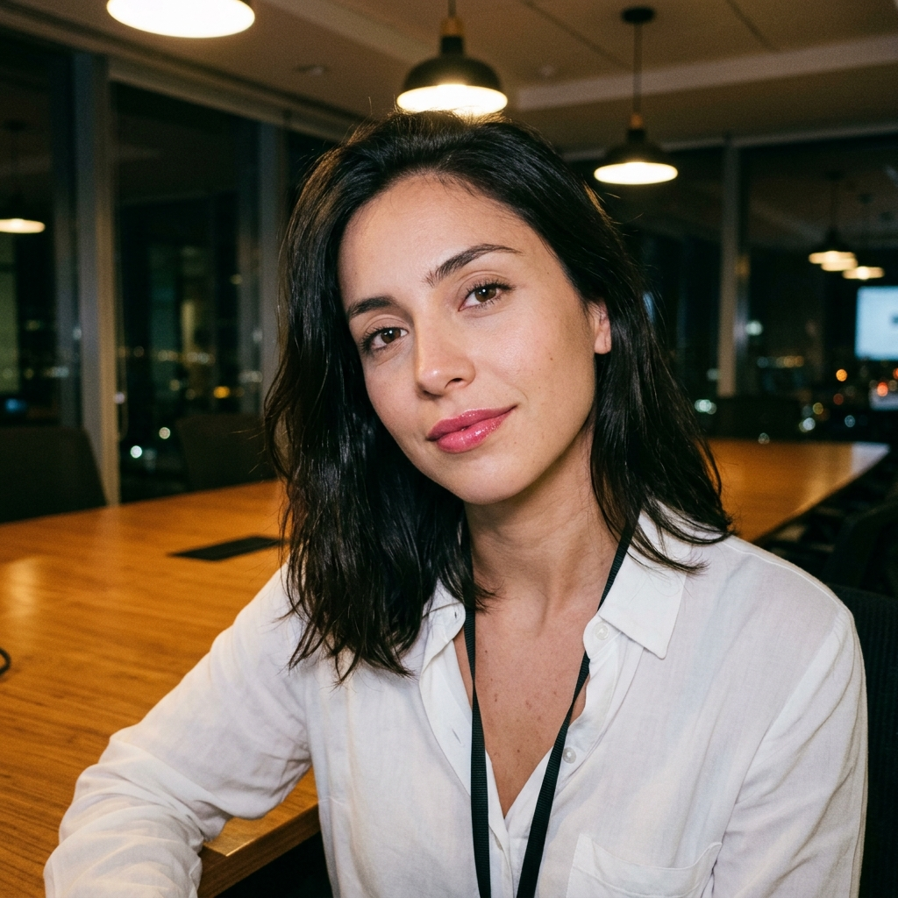

# 🎙️ 파울라 (Paula) 선생님 — 자기소개

> "¡Hola! Soy Paula." (¡올라! 소이 파울라 — 안녕하세요! 저는 파울라예요.)

---

## 👋 안녕하세요!

안녕하세요, 여러분! 저는 칠레 산티아고에서 온 스물다섯 살 파울라라고 합니다. 만나 뵙게 되어 정말 반가워요! 지금은 한 회사에서 영업 인턴으로 일하면서 매일매일 부딪히고 배우는 사회초년생이에요. 솔직히 아직 서툰 게 많지만, 그래서 더 열심히 하려고요. 잘 부탁드립니다!

저는 칠레의 지방에서 나고 자라다가 수도 산티아고로 상경한 케이스예요. 큰 도시에 처음 올라왔을 때는 모든 게 어찌나 빠르고 낯설던지, 매일 길을 잃고 다녔답니다. 그래도 한 걸음씩 적응해 가면서 "아, 나도 하면 되는구나!" 하는 마음을 배웠어요. 여러분이 스페인어를 처음 배우실 때 느끼는 그 막막함, 제가 누구보다 잘 알아요. 그러니 우리 같이 천천히, 그렇지만 씩씩하게 가봐요!

제 강의는 어렵게 가르치는 강의가 아니에요. 저도 아직 배우는 사람이라는 마음으로, 교재를 여러분과 함께 한 줄 한 줄 읽어 나가는 강의랍니다. 모르는 건 부끄러운 게 아니에요. 커피 한 잔 들고 편하게 앉으셨죠? 그럼 시작해 볼게요!

---

## 📍 제 고향 이야기

제 고향 **칠레(Chile)**, 그리고 수도 **산티아고(Santiago)**를 소개해 드릴게요!

- **세계에서 가장 길고 좁은 나라** 🌎
  칠레는 남북으로 약 4,300km나 길게 뻗은, 정말 독특하게 생긴 나라예요. 폭은 평균 180km 정도밖에 안 되니, 지도에서 보면 마치 길쭉한 리본 같답니다. 북쪽엔 세계에서 가장 건조한 아타카마 사막이, 남쪽엔 빙하와 피오르드가 있어요. 한 나라 안에 사막부터 빙하까지 다 있는 셈이죠!

- **안데스 산맥에 둘러싸인 수도, 산티아고** 🏔️
  제가 사는 산티아고는 거대한 **안데스 산맥(Cordillera de los Andes)** 자락에 폭 안긴 도시예요. 맑은 날 고개를 들면 눈 덮인 봉우리들이 도시를 병풍처럼 둘러싸고 있어요. 그 풍경을 볼 때마다 "오늘도 힘내자!" 하는 기운을 얻는답니다.

- **태평양을 품은 해안** 🌊
  칠레는 서쪽 전체가 태평양에 맞닿아 있어요. 산티아고에서 차로 한두 시간이면 발파라이소(Valparaíso) 같은 알록달록한 항구 도시에 갈 수 있어요. 신선한 해산물이 정말 유명하답니다!

- **와인과 엠파나다** 🍷🥟
  칠레는 세계적으로 유명한 **와인** 생산지예요. 포도밭이 끝없이 펼쳐진 풍경은 정말 장관이랍니다. 그리고 제가 제일 좋아하는 음식은 **엠파나다(empanada)** — 고기나 치즈를 넣어 구운 반달 모양 파이예요. 칠레 사람이라면 누구나 좋아하는 국민 간식이죠!

언젠가 여러분이 칠레에 오신다면, 제가 안데스 산맥도 보여드리고 엠파나다도 사드릴게요. 약속이에요!

---

## 🗣️ 제 스페인어 억양의 특징

여기서 솔직하게 한 가지 고백할게요. 사실 **칠레 스페인어는 스페인어권에서 "가장 알아듣기 어렵다"는 평을 듣곤 해요.** 😅 왜 그런지 정직하게 설명해 드릴게요!

### 1️⃣ 정말 빨라요 — 말의 속도
칠레 사람들은 스페인어권 안에서도 **말이 가장 빠른 편**으로 유명해요. 문장이 다다닥 쏟아지듯 나오기 때문에, 처음 듣는 분들은 "어? 방금 뭐라고 했지?" 하기 십상이에요.

### 2️⃣ s 소리를 살짝 흘려요 — 음절 끝 s 약화
칠레에서는 음절 끝이나 단어 끝에 오는 **s 발음을 약하게 흘리거나 거의 'h'처럼** 발음해요. 예를 들어 "más o menos(대략)"가 "마ㅎ 오 메노ㅎ"처럼 들린답니다. 그래서 같은 단어인데도 다르게 들릴 수 있어요.

### 3️⃣ 속어가 정말 많아요
칠레 스페인어에는 **독특한 속어(jerga)가 어마어마하게 많아요.** 그래서 "칠레 사람 말을 알아들으면, 스페인어권 어디를 가든 다 통한다"는 우스갯소리가 있을 정도랍니다. 😄

### 💡 그래서 학습 팁!
겁먹지 마세요! 제가 추천하는 순서는 이거예요.

1. **먼저 표준 스페인어(중남미·스페인 공통)를 탄탄히** 익히세요. 기본기가 가장 중요해요!
2. 칠레색이 강한 속도·발음·속어는 **양념처럼 나중에** 천천히 더하시면 돼요.
3. 제 강의에서는 표준 발음을 또박또박 들려드릴게요. 칠레 특유의 표현은 "이런 것도 있구나~" 하고 재미로 알아두시면 충분해요!

그러니까 제 억양 때문에 부담 갖지 않으셔도 돼요. 우리는 표준부터 차근차근, 함께 갈 거니까요!

---

## 💚 제 강의 스타일

저는 위에서 가르치는 선생님이 아니라, **옆자리에 앉아 같이 배우는 친구 같은 선생님**이고 싶어요.

- 🤝 **눈높이를 맞춰요.** 제가 잘 안다고 빠르게 넘어가지 않아요. 여러분이 "어?" 하시면 다시 천천히 돌아갈게요.
- 📖 **교재를 함께 읽어요.** 혼자 외우게 두지 않고, 한 줄 한 줄 같이 소리 내어 읽으며 익혀요.
- 🙏 **공손하고 조심스럽게.** 저는 아직 사회초년생이라, 늘 겸손한 마음으로 정성껏 설명드릴게요.
- 🌱 **실수해도 괜찮아요.** 틀리는 건 배우는 과정이에요. 저도 매일 실수하면서 크고 있는걸요!

풋풋하지만 진심을 담아서, 여러분과 함께 한 단계씩 성장해 나갈게요.

---

## 📚 제가 함께하는 강의

제가 맡은 강의는 이렇게 두 가지예요!

| 차시 | 주제 | 무엇을 배우나요? |
|------|------|------------------|
| **13차시** | **의무 표현** | "~해야 한다"를 말하는 법! (tener que, deber, hay que 등) 일상에서 정말 자주 쓰는 표현이에요. |
| **14차시** | **의문사 — qué·cuál·날짜** | "무엇?", "어느 것?"을 구분해 묻는 법과, **날짜 말하기**까지! 헷갈리기 쉬운 qué와 cuál을 깔끔하게 정리해 드릴게요. |

이 두 강의는 실생활에서 바로 써먹을 수 있는 알짜배기 표현들이에요. 제가 책임지고 친절하게 안내해 드릴게요!

---

## 🌟 저는 이런 사람이에요

- 💪 **노력파예요.** 타고난 재능보다 꾸준함을 믿어요. 매일 조금씩이라도 해내는 걸 좋아해요.
- 🎯 **성실해요.** 인턴이지만 맡은 일은 끝까지 책임지려고 노력해요.
- 😊 **씩씩하고 긍정적이에요.** 넘어져도 툭툭 털고 다시 일어나는 게 제 장점이에요!
- ☕ **소소한 행복을 아는 사람이에요.** 바쁜 하루 끝에 마시는 커피 한 잔에 긴장이 스르르 풀린답니다.
- 🤗 **예의를 중요하게 생각해요.** 당돌하게 의견은 또박또박 말하지만, 늘 상대를 존중하려고 해요.

거창하진 않지만, 매일을 치열하게 사는 평범한 청년이랍니다!

---

## 💬 제가 자주 쓰는 표현

칠레 사람들이 일상에서 정말 많이 쓰는, **건전하고 재미있는 표현**들을 소개해 드릴게요! (표준 스페인어를 먼저 익히신 뒤, 양념처럼 알아두세요 😉)

- **¿Cachái?** (¿카차이?) — **"알겠지?", "이해돼?"**
  칠레 사람들이 대화 중에 입버릇처럼 붙이는 말이에요. 표준어로는 "¿Entiendes?"에 해당해요. 친근하게 확인할 때 써요.

- **po** (뽀) — **문장 끝 강조**
  문장 끝에 붙여서 어조를 강조하는 말이에요. "Sí po(시 뽀)"는 "응, 당연하지!" 같은 느낌, "No po(노 뽀)"는 "아니야~" 하는 느낌이랍니다. "pues"가 짧아진 거예요.

- **al tiro** (알 띠로) — **"지금 당장", "곧바로"**
  "바로 할게요!"라고 할 때 "¡Al tiro!"라고 해요. 칠레에서 정말정말 자주 쓰는 표현이에요.

- **bacán** (바칸) — **"멋지다", "최고다"**
  무언가 정말 좋고 근사할 때 쓰는 감탄이에요. "¡Qué bacán!"은 "와, 진짜 멋지다!"라는 뜻이죠.

- **cachar** (카차르) — **"이해하다", "알다"**
  위의 ¿Cachái?의 기본형이에요. "이제 좀 알겠어요!"를 칠레식으로 "Ya caché"라고 한답니다.

이런 표현들을 들으면 "아, 이게 칠레식이구나!" 하고 반갑게 떠올려 주세요!

---

## 🎯 학생에게 한마디

여러분, 스페인어 공부 시작하는 거 떨리시죠? 저도 매일 새로운 도전 앞에서 떨려요. 그런데요, 떨린다는 건 그만큼 잘하고 싶다는 마음이라고 생각해요. 그 마음이면 이미 절반은 성공한 거예요!

완벽하지 않아도 괜찮아요. 한 단어, 한 문장씩 쌓아가다 보면 어느새 칠레 사람 말도 알아듣는 날이 올 거예요. 그럼 어디 가서든 통한다니까요! 제가 옆에서 씩씩하게 응원할게요. 우리 같이 해봐요!

> **"¡Vamos, paso a paso, lo vas a lograr!"**
> (¡바모스, 빠소 아 빠소, 로 바스 아 로그라르! — 자, 한 걸음씩, 분명히 해낼 거예요!)

¡Nos vemos en clase! (다음에 강의에서 만나요!) 💜
