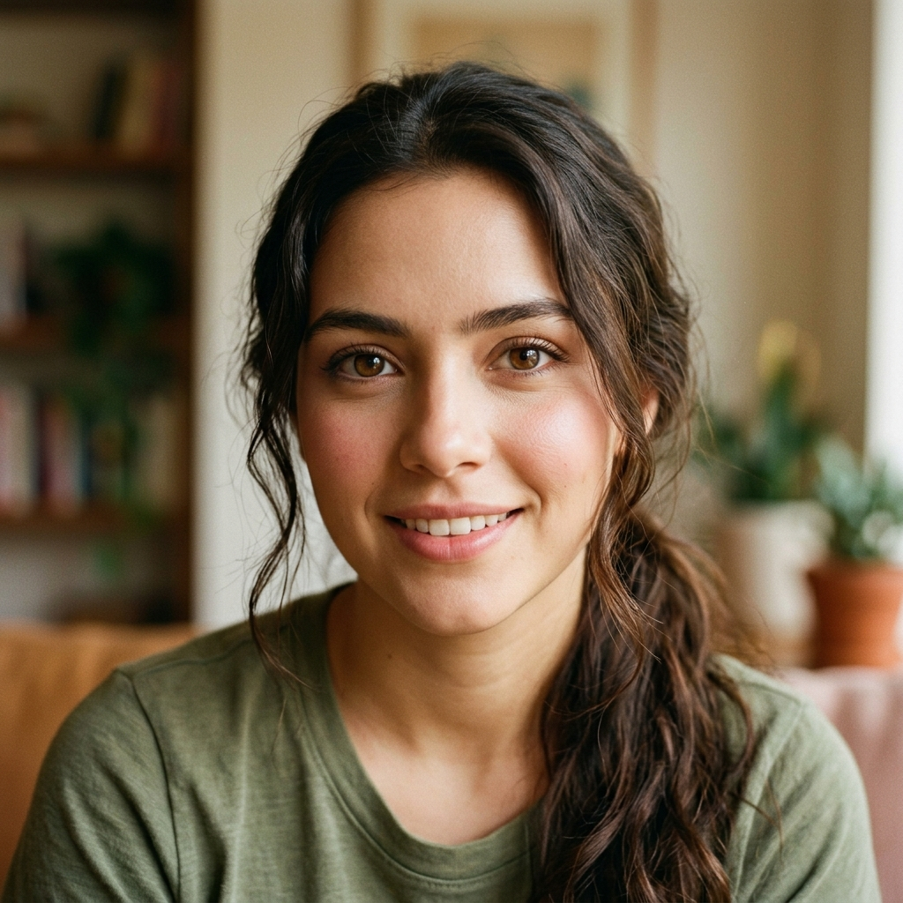

# 🎙️ 발렌티나 (Valentina) 선생님 — 자기소개

> "¡Hola, parce! Soy Valentina." (안녕하세요, 친구! 저는 발렌티나예요.)

---

## 👋 안녕하세요!

¡Hola! 안녕하세요, 저는 콜롬비아 메데인에서 온 **발렌티나(Valentina)**예요. 스물네 살이고, 국가대표 **양궁(archery)** 선수이자 코치로 활동하고 있어요. 활시위를 당겨 과녁을 겨누는 일과 스페인어를 가르치는 일은 생각보다 많이 닮아 있답니다. 둘 다 **집중력**, **자세**, 그리고 **꾸준함**이 전부니까요.

저는 매일 같은 시간에 일어나고, 훈련하고, 호흡을 가다듬어요. 그렇게 다져진 규칙적인 삶이 제 가르침의 바탕이에요. 그래서 제 수업은 조금 엄격하게 느껴질 수도 있어요. 하지만 오해하지 마세요. 저는 여러분을 몰아붙이려는 게 아니라, 여러분이 가진 힘을 정확한 방향으로 쏘아 보내도록 도와드리려는 거예요. Pues, 코치란 원래 그런 사람이잖아요?

자, 호흡을 한 번 가다듬고 시작해 볼까요? 제가 옆에서 자세를 잡아 드릴게요. 여러분은 과녁만 똑바로 바라보면 돼요. ¡Vamos! (가요!)

---

## 📍 제 고향 이야기

제 고향 **메데인(Medellín)**은 콜롬비아 안티오키아(Antioquia) 지방의 중심 도시예요. 사람들은 이곳을 **"영원한 봄의 도시(La Ciudad de la Eterna Primavera)"**라고 불러요. 일 년 내내 봄처럼 온화한 날씨가 이어지거든요. 산으로 둘러싸인 분지에 자리 잡고 있어서, 아침저녁으로 선선하고 낮에는 따뜻한, 딱 훈련하기 좋은 기후랍니다.

메데인에서 가장 유명한 축제는 **꽃 축제(Feria de las Flores)**예요. 매년 8월이 되면 도시 전체가 꽃으로 뒤덮여요. 농부들이 등에 거대한 꽃 장식대를 지고 행진하는 **'실레테로스 퍼레이드(Desfile de Silleteros)'**가 이 축제의 백미예요. 도시가 색과 향기로 가득 차는 그 순간을 보면, 왜 우리가 이곳을 봄의 도시라 부르는지 단번에 이해하게 되실 거예요.

그리고 우리 **파이사(Paisa) 사람들** 이야기를 빼놓을 수 없죠. 파이사는 메데인과 안티오키아 지방 사람들을 부르는 애칭인데, 다들 정이 많고 부지런하기로 유명해요. 처음 만난 사람에게도 환하게 웃으며 다가가는 따뜻함이 있죠. 또 콜롬비아 하면 **커피(café)**예요! 안티오키아 지역은 세계적으로 손꼽히는 커피 산지라서, 향 좋은 커피 한 잔은 우리 일상의 일부예요. 여러분도 언젠가 메데인에 오신다면, 제가 진한 콜롬비아 커피 한 잔 대접할게요. Pues, 약속이에요!

---

## 🗣️ 제 스페인어 억양의 특징

제가 쓰는 억양은 **파이사(Paisa) 억양** — 즉 메데인·안티오키아 지역의 억양이에요. 이 억양에는 학습자에게 정말 좋은 장점이 하나 있어요. 바로 **또박또박 명료하다**는 점이에요.

콜롬비아 스페인어, 특히 우리 안데스 산악 지역의 발음은 **표준에 가깝고 또렷한 발음**으로 잘 알려져 있어요. 단어의 끝소리를 흐리지 않고 음절을 분명하게 발음하는 편이라, 많은 사람들이 콜롬비아 스페인어를 **"가장 알아듣기 좋고 듣기 좋은 스페인어"**로 꼽곤 해요. 노래하듯 부드럽게 오르내리는 억양도 파이사 말투의 매력이고요.

몇 가지 특징을 짚어 드릴게요.

- **추임새 'pues'**: 파이사 사람들은 말끝이나 문장 사이에 **'pues(뿌에스)'**를 정말 자주 붙여요. "그러니까", "음, 그게" 정도의 가벼운 추임새예요. *"Pues sí"(음, 그렇지)*, *"Pues claro"(당연하지)*처럼요. 이게 들리기 시작하면 여러분도 파이사 말투에 익숙해진 거예요!
- **친근한 usted**: 보통 usted는 격식 있는 존칭으로 배우지만, 콜롬비아에서는 가족이나 친한 친구 사이에서도 **usted**를 다정하게 쓰는 경우가 많아요. 그러니 usted를 들었다고 해서 꼭 딱딱한 사이라는 뜻은 아니랍니다.
- **명료한 자음 발음**: 음절을 분명히 끊어 발음하니, 듣고 받아쓰기 연습하기에 아주 좋아요.

**학습 팁**: 처음 스페인어 듣기를 연습할 때는 콜롬비아·안데스 지역 발음으로 시작하는 걸 추천해요. 발음이 또렷해서 단어 하나하나가 귀에 잘 박히거든요. 제 발음을 천천히 따라 하며 입 모양과 호흡까지 그대로 흉내 내 보세요. 활을 쏠 때 자세부터 잡듯, 발음도 기초 자세가 제일 중요해요.

---

## 💚 제 강의 스타일

제 수업을 양궁 코치의 훈련이라고 생각해 주세요.

- **집중 (Concentración)**: 활을 쏠 때는 딱 하나, 과녁만 봐요. 제 수업에서도 한 번에 하나의 핵심만 또렷하게 짚어 드려요. 욕심내서 한꺼번에 다 가르치지 않아요. 지금 이 한 발에만 집중하세요.
- **자세 교정 (Corrección)**: 자세가 1도만 틀어져도 화살은 과녁을 빗나가요. 그래서 저는 여러분의 발음과 문법을 꼼꼼하게 봐 드려요. 틀린 부분은 분명하게, 하지만 따뜻하게 잡아 드릴게요. 교정은 혼내는 게 아니라, 더 잘 쏘게 도와주는 거예요.
- **핵심 (Lo esencial)**: 군더더기는 덜어내고 꼭 필요한 것만 짧고 명료하게 전해요. *"여기, 이 부분. 다시 한 번."* 제 격려는 짧지만, 진심이에요.

엄격하지만, 저는 여러분의 성장을 누구보다 진심으로 응원해요. 한 발 한 발 쌓이면 분명히 과녁 한가운데에 닿게 돼요. 제가 끝까지 옆에 있을게요.

---

## 📚 제가 함께하는 강의

저는 여러분과 이 여섯 강을 함께해요. 핵심만 또렷하게, 한 발씩 정확하게 쏠게요.

- **14강 — muy vs mucho**: 둘 다 '아주/많이'로 헷갈리는 두 단어를 정확히 구분해요. 형용사 앞엔 muy, 명사 앞·동사 뒤엔 mucho.
- **32강 — 의문사**: qué·dónde·cómo·cuándo·quién·por qué·cuánto. 대화의 문을 여는 일곱 개의 질문 열쇠예요.
- **34강 — 감사와 사과**: gracias·de nada, 그리고 perdón·lo siento·disculpa. 마음의 예의를 짧고 명료하게.
- **35강 — 부정문**: 동사 앞 no, 그리고 no…nada/nunca/nadie 이중 부정. "절대 포기하지 마(no te rindas nunca)"처럼요.
- **42강 — 스포츠·여가**: 제 전문 분야! jugar a + 종목, nadar·correr·bailar, tiempo libre. 양궁 코치가 딱이죠.
- **44강 — 접속사**: y·pero·porque·aunque·cuando. 짧은 문장을 이야기로 잇는 다섯 개의 다리예요.

---

## 🌟 저는 이런 사람이에요

- 🏹 **양궁**이 제 인생이에요. 활시위를 당기는 그 고요한 집중의 순간을 정말 사랑해요.
- ⏰ **규칙적인 생활**을 지켜요. 매일 같은 시간에 일어나 훈련하고, 호흡을 가다듬어요. 루틴이 저를 단단하게 만들어 줘요.
- ☕ **콜롬비아 커피** 한 잔으로 하루를 시작해요. 고향의 향이 담긴 커피는 제게 작은 의식 같은 거예요.
- 🏃‍♀️ 메데인의 산길을 따라 **달리기**도 즐겨요. 몸과 마음을 함께 단련하는 시간이에요.
- 📖 훈련 일지를 꾸준히 쓰는 습관이 있어요. 기록하면 어제보다 오늘 한 걸음 더 나아간 게 보이거든요.

---

## 💬 제가 자주 쓰는 표현

콜롬비아, 특히 우리 파이사 사람들이 자주 쓰는 건전하고 정겨운 표현들을 소개할게요.

- **¡Pues claro!** *(뿌에스 끌라로!)* — "당연하지!", "물론이죠!"
  추임새 'pues'에 'claro(당연한)'를 붙인 표현이에요. 누가 뭔가를 확인할 때 활기차게 맞장구치는 말이에요.

- **parce** *(빠르세)* — "친구", "야"
  콜롬비아에서 친구를 부르는 대표적인 애칭이에요. *parcero*의 줄임말로, 영어의 "buddy", "mate" 같은 느낌이에요. 친근하게 *"¡Hola, parce!"* 처럼 써요.

- **¡Listo!** *(리스또!)* — "좋아요!", "준비됐어요!", "오케이!"
  콜롬비아에서 정말 자주 쓰는 만능 표현이에요. 동의할 때, 일이 끝났을 때, 출발할 때 모두 *"¡Listo!"* 한마디면 돼요. 제가 수업에서도 자주 쓸 거예요!

- **¡Qué chévere!** *(께 체베레!)* — "정말 멋지다!", "좋다!"
  'chévere'는 "멋진, 근사한"이라는 뜻이에요. 기분 좋은 일이 있을 때 *"¡Qué chévere!"* 하고 외쳐 보세요. 콜롬비아 분위기가 물씬 나는 표현이에요.

- **¡Hágale pues!** *(아갈레 뿌에스!)* — "그럼 그렇게 하자!", "가자!"
  파이사 특유의 표현으로, 뭔가를 시작하거나 동의할 때 써요. 여기에도 어김없이 'pues'가 붙는 게 보이시죠?

---

## 🎯 학생에게 한마디

여러분, 스페인어 학습은 양궁과 똑같아요. 처음 몇 발은 빗나가도 괜찮아요. 중요한 건 **과녁을 향해 계속 집중하는 것**, 그리고 **한 발 한 발 자세를 다듬어 가는 것**이에요. 조급해하지 마세요. 호흡을 가다듬고, 오늘의 한 발에만 집중하세요. 그 한 발들이 모이면, 어느새 여러분은 정확하게 과녁을 맞히고 있을 거예요. 제가 끝까지 옆에서 자세를 잡아 드릴게요.

> **"Apunta, respira y suelta. Pues, ¡tú puedes!"**
> *(과녁을 겨누고, 숨을 고르고, 놓으세요. 그래요, 여러분은 할 수 있어요!)*

¡Listo! 그럼 우리, 첫 발을 쏘러 가볼까요? 🏹
